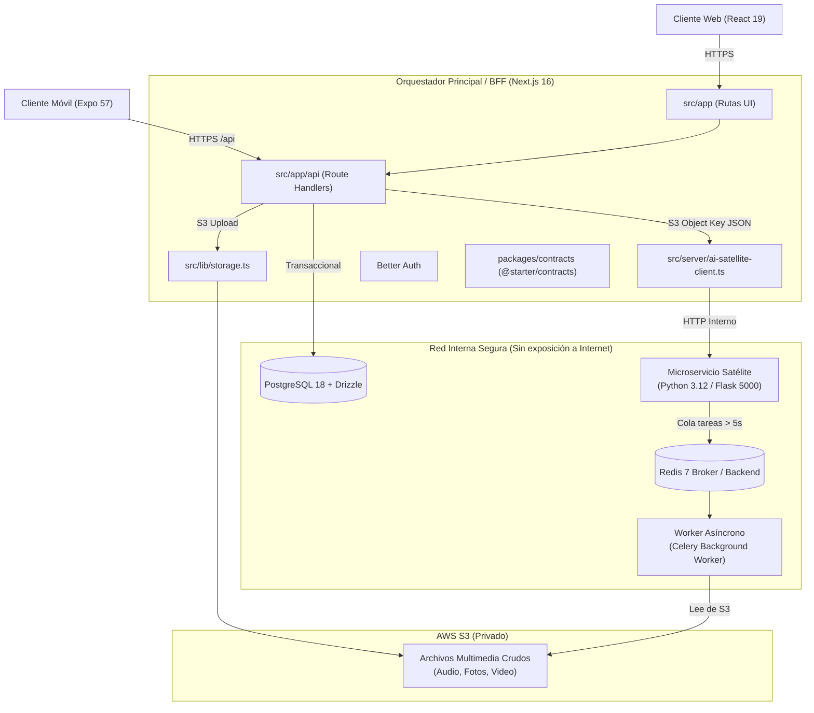

# Arquitectura del Sistema — Golden Starter V2

> Arquitectura canónica para monorrepositorios Web & Mobile multi-tenant de alto rendimiento bajo el patrón **Backend for Frontend (BFF)** con microservicio satélite de IA y metodología Spec-Driven Development.

## 1. Visión General del Sistema y Patrón BFF

La arquitectura emplea un **orquestador principal Full-Stack (Next.js 16)** que actúa como BFF, gestionando la interfaz de usuario, control de acceso y transacciones relacionales estándar. Se apoya en un **microservicio satélite interno (Python/Flask + Celery)** dedicado exclusivamente a procesamiento pesado de medios e integración de Inteligencia Artificial (visión computacional, transcripción y RAG).

## 2. Reglas de Comunicación y Flujo de Medios

1. **Aislamiento Estricto de Base de Datos:**
   - El microservicio de Flask y los workers de Celery tienen **estrictamente prohibido conectarse a PostgreSQL** para realizar operaciones transaccionales o CRUD sobre entidades de negocio o tablas de usuarios.
   - Todo el acceso a datos de negocio se canaliza exclusivamente a través de Next.js utilizando Drizzle ORM.

2. **Transferencia de Medios Segura (Zero Binary to Flask):**
   - Las aplicaciones cliente (Web o Móvil) **nunca envían archivos multimedia masivos directamente a Flask**.
   - Next.js recibe el archivo y lo sube directamente al bucket privado de AWS S3 mediante `src/lib/storage.ts`.
   - Next.js envía una petición HTTP interna a Flask (`http://flask-api:5000/process/sync` o `/process/async`) conteniendo **únicamente el S3 Object Key** y metadatos en formato JSON.

3. **Manejo de Tiempos de Ejecución (Timeouts):**
   - **Flujos Síncronos (< 5 segundos):** Para tareas rápidas (ej. extracción de metadatos o redimensionamiento), Flask procesa la carga y devuelve la respuesta JSON en la misma conexión HTTP.
   - **Flujos Asíncronos (> 5 segundos):** Para tareas pesadas (ej. transcripción de audio o análisis de visión por lotes), Flask delega el trabajo a Celery y devuelve inmediatamente un `taskId`. Next.js consulta el estado mediante polling (`aiSatelliteClient.pollTaskResult(taskId)`).

4. **Restricción de Modelos de IA:**
   - Todo flujo de IA debe integrarse a través de SDKs oficiales de proveedores en la nube autorizados (Google Gemini, OpenAI, Anthropic).
   - Queda prohibida la instalación o configuración de modelos locales pesados (como Ollama) en este entorno de microservicios.

## 3. Topología de Infraestructura (Local y Producción)

Orquestada mediante Docker Compose en `internal-network`:
- **`next-app` (Puerto 3000 expuesto):** El único contenedor con salida a internet o mapeo a proxy inverso Nginx/Caddy.
- **`db` (Puerto 5432 expuesto solo localmente):** Contenedor de PostgreSQL 18.
- **`flask-api` (Sin puertos expuestos):** Accesible únicamente dentro de la red interna desde `next-app`.
- **`redis` (Sin puertos expuestos):** Intermediario de mensajes para Celery.
- **`celery-worker` (Sin puertos expuestos):** Ejecuta tareas en segundo plano consumiendo memoria aislada para IA.

## 4. Principios de Aislamiento y Dominio

1. **Multi-Tenancy Estricto (`organizationId`):**
   - Toda tabla de la base de datos vinculada a datos de negocio debe incluir `organizationId NOT NULL`.
   - Ninguna consulta ni mutación en Route Handlers omite el filtro por `organizationId` obtenido de la sesión autenticada.
   - El acceso cruzado entre tenants está estrictamente bloqueado con `403 Forbidden`.

2. **Fidelidad al Contrato (`packages/contracts`):**
   - Los contratos en `@starter/contracts` son esquemas Zod puros sin dependencias de React ni Node.js nativo.
   - Tanto el frontend web como la app móvil y el cliente de Flask importan los esquemas desde este paquete compartido.

3. **Arquitectura Offline Móvil Idempotente:**
   - La aplicación móvil encola eventos en una tabla SQLite local (`outbox`).
   - Cada evento posee un `clientEventId` único (UUIDv4) generado en el dispositivo móvil.
   - El servidor registra los eventos deduplicando por `(organizationId, clientEventId)`: ante retransmisiones, responde con el resultado previo sin re-ejecutar efectos colaterales.

4. **Observabilidad y Seguridad de Logs:**
   - Redactor automático de expresiones regulares (`src/lib/error-logger.ts`) que reemplaza credenciales, passwords, tokens y llaves por `[REDACTED]` antes de escribir en disco o en la tabla `error_logs`.

## 5. Coordinación y Perfiles Especialistas de Codex

La conversación principal de Codex coordina el diálogo con el owner, aplica las instrucciones de `AGENTS.md`, conserva el hilo SDD/TDD e integra el trabajo delegado. No existe un perfil `orchestrator` en `.codex/agents/`; esa responsabilidad pertenece a la conversación principal.

Los perfiles especialistas delimitan tareas delegadas. Sus nombres, permisos, ownership, entregas y puntos de handoff se mantienen en el [registro de agentes](docs/agent-registry.md), y sus instrucciones canónicas viven en `.codex/agents/*.toml`. Los flujos reutilizables se documentan en `.agents/skills/`.
