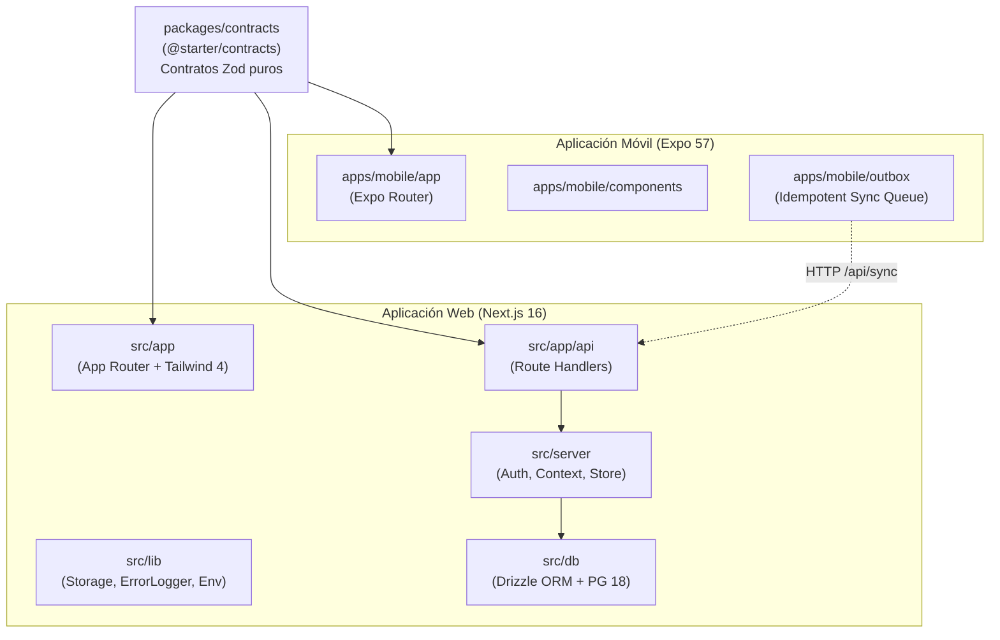

# Arquitectura del Sistema — Golden Starter V2

> Arquitectura canónica para monorrepositorios Web & Mobile multi-tenant de alto rendimiento con desarrollo asistido por agentes de IA y metodología Spec-Driven Development.

## 1. Visión General del Monorepo

## 2. Principios de Aislamiento y Dominio

1. **Multi-Tenancy Estricto (`organizationId`):**
   - Toda tabla de la base de datos vinculada a datos de negocio debe incluir `organizationId NOT NULL`.
   - Ninguna consulta ni mutación en Route Handlers omite el filtro por `organizationId` obtenido de la sesión autenticada.
   - El acceso cruzado entre tenants está estrictamente bloqueado con `403 Forbidden` salvo autorización explícita de `admin_global`.

2. **Fidelidad al Contrato (`packages/contracts`):**
   - Los contratos en `@starter/contracts` son esquemas Zod puros sin dependencias de React ni Node.js nativo.
   - Tanto el frontend web como la app móvil importan los tipos y esquemas desde este paquete compartido para garantizar sincronización bidireccional inmediata de contratos.

3. **Arquitectura Offline Móvil Idempotente:**
   - La aplicación móvil encola eventos en una tabla SQLite local (`outbox`).
   - Cada evento posee un `clientEventId` único (UUIDv4) generado en el dispositivo móvil.
   - El servidor registra los eventos deduplicando por `(organizationId, clientEventId)`: ante retransmisiones por inestabilidad de red, el servidor responde con el resultado previo sin re-ejecutar efectos colaterales.

4. **Almacenamiento Desacoplado y Seguro:**
   - La interfaz de almacenamiento en `src/lib/storage.ts` abstrae si los archivos residen en el sistema local o en un bucket AWS S3.
   - Validación estricta contra ataques de directorio relativo (`directory traversal`) antes de cualquier operación.

5. **Observabilidad y Seguridad de Logs:**
   - Redactor automático de expresiones regulares que reemplaza credenciales, passwords, tokens y llaves por `[REDACTED]` antes de escribir en disco o en la tabla `error_logs`.

## 3. Catálogo y Límites de Agentes

| Agente | Alcance de Modificación | Rol Principal |
| :--- | :--- | :--- |
| `orchestrator-agent` | Orquestación, `TASKS.md`, integración | Conduce el flujo SDD y asegura gates |
| `product-manager-agent` | `PRD.md`, `specs/`, sesiones Q&A | Define requisitos y criterios de aceptación |
| `change-planner-agent` | `artifacts/change-plans/` | Descompone specs en tareas ejecutables |
| `backend-agent` | `src/server/**`, `src/app/api/**` | Implementa Route Handlers y lógica de backend |
| `frontend-agent` | `src/app/**` (no api), `src/components/**` | Construye páginas, formularios y layouts |
| `mobile-agent` | `apps/mobile/**` | Desarrolla pantallas React Native y cola outbox |
| `infra-data-agent` | `src/db/**`, `drizzle/**` | Diseña esquemas PostgreSQL y migraciones |
| `test-engineer-agent`| `tests/**` | Escribe suites unitarias, integración y E2E |
| `qa-agent` | Solo lectura (auditoría) | Valida scorecards de specs de forma independiente |
| `security-agent` | Solo lectura (auditoría) | Revisa multi-tenant, sanitización y secretos |
| `devops-agent` | `docker-compose*`, `Dockerfile`, CI/CD | Empaqueta, gestiona contenedores y despliegues |
| `sre-agent` | Monitoreo, backups, runbooks | Mantiene resiliencia y planes de contingencia |
