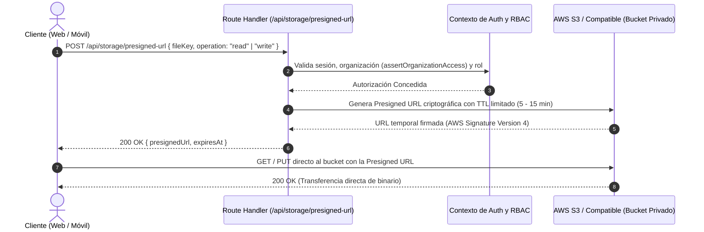

# ADR-004: Almacenamiento Privado S3 con URLs Firmadas Temporales para Archivos Protegidos

- **Estado:** ACEPTADO
- **Fecha:** 2026-09-21
- **Decisores:** `orchestrator-agent`, `security-agent`, `backend-agent`, `sre-agent`, `docs-agent`
- **Consultados:** `infra-data-agent`, `frontend-agent`, `mobile-agent`
- **Referencias:** [`STACK.md`](../../STACK.md), [`ARCHITECTURE.md`](../../ARCHITECTURE.md), [`docs/architecture/starter-architecture-guide.md`](../architecture/starter-architecture-guide.md), [`docs/security/work-orders-security-review.md`](../security/work-orders-security-review.md)

---

## 1. Contexto y Planteamiento del Problema

Las operaciones en aplicaciones basadas en **Golden Starter V3** involucran frecuentemente la carga, almacenamiento y consulta de archivos binarios con datos privados sensibles y documentos confidenciales:

- Fotografías y evidencias de operaciones tomadas por operadores o inspectores en campo.
- Identificaciones oficiales y documentos de verificación de identidad.
- Documentos contractuales y cartas de consentimiento debidamente firmadas.
- Facturas, órdenes de compra y recibos escaneados.
- Paquetes de exportación de datos y reportes de auditoría en formato PDF/ZIP.

Estos activos conllevan obligaciones regulatorias rigurosas:

1. **Confidencialidad Absoluta:** Ningún archivo puede ser accesible de forma pública, ni predecible mediante URLs secuenciales, ni indexable por motores de búsqueda.
2. **Aislamiento Multi-Tenant:** Una organización no debe poder acceder a los archivos de otra bajo ninguna circunstancia.
3. **Escalabilidad y Rendimiento:** El servidor de aplicaciones Next.js no debe saturarse transmitiendo gigabytes de datos binarios (I/O streaming) en cada petición.
4. **Efimeridad de Contenedores:** Los archivos no deben depender del sistema de archivos local de los contenedores Docker, los cuales son recreados en cada despliegue.

---

## 2. Alternativas Consideradas

### 2.1 Opción A: Almacenamiento en Sistema de Archivos Local del Servidor (`/uploads`)

- **Descripción:** Guardar los archivos en una carpeta del disco del host montada en el contenedor Docker.
- **Razón de Descarte:**
  - Riesgo severo de agotamiento de disco en la máquina virtual (contingencia SRE crítica).
  - Impide la replicación o escalado horizontal del backend en múltiples nodos o servidores sin configurar sistemas de archivos distribuidos complejos (NFS, GlusterFS).
  - Dificulta la gestión de respaldos y recuperación ante desastres: el respaldo de base de datos (`pg_dump`) no sincroniza atómicamente con los archivos en disco.

### 2.2 Opción B: Persistencia en Base de Datos Relacional (`BYTEA` / BLOBs en PostgreSQL)

- **Descripción:** Almacenar el contenido binario directamente en columnas de tablas PostgreSQL.
- **Razón de Descarte:**
  - Degrada gravemente el rendimiento general de la base de datos relacional y satura la memoria compartida (`shared_buffers`).
  - Dispara el tiempo y volumen de los respaldos lógicos (`pg_dump`), encareciendo el costo de almacenamiento y retención a largo plazo.

### 2.3 Opción C: Buckets S3 Públicos o CDN Directa sin Autenticación

- **Descripción:** Subir archivos a un bucket con permisos públicos de lectura y entregar la URL fija directamente al cliente.
- **Razón de Descarte:**
  - **Inaceptable por seguridad y privacidad:** Constituye una violación de normativas de protección de datos personales. Cualquier tercero con acceso al enlace o que descubra el patrón de claves podría descargar información confidencial y privada.

### 2.4 Opción D: Proxy de Archivos Completo a través de Route Handlers de Next.js

- **Descripción:** El cliente solicita el archivo al servidor Next.js, el servidor lo descarga de un almacenamiento privado y lo retransmite al navegador o móvil.
- **Razón de Descarte:**
  - Doble consumo de ancho de banda y uso intensivo de CPU y memoria en el servidor web Next.js, bloqueando hilos de I/O para operaciones que el almacenamiento en la nube puede resolver de forma directa y segura.

---

## 3. Decisión Adoptada

Se adopta **Almacenamiento Privado en AWS S3 (o almacenamiento compatible con la API S3 como Cloudflare R2 o MinIO) con acceso 100% privado y URLs prefirmadas temporales (_Presigned URLs_) de corta vigencia**.

### Flujo Operativo y de Seguridad:

### Reglas de Implementación:

1. **Configuración de Seguridad del Bucket:**
   - Opción _Block Public Access_ (BPA) activada en su totalidad en el bucket de S3.
   - Cifrado en reposo del lado del servidor habilitado (SSE-S3 con AES-256 o SSE-KMS).
   - Acceso al bucket restringido a roles IAM específicos con principio de mínimo privilegio (`s3:GetObject`, `s3:PutObject`).
2. **Estructura Canónica de Claves de Objeto (Keys):**
   - Para garantizar particionamiento multi-tenant estricto y prevenir colisiones:
     `tenants/{organizationId}/{category}/{resourceId}/{uuid}-{filename}`
     _(Ejemplo: `tenants/org-demo-001/inspections/insp-001/evidence/a1b2c3d4-foto-evidencia.jpg`)_
3. **Tiempos de Expiración (TTL) Estrictos:**
   - **Subida (`PutObject`):** Vigencia máxima de **5 minutos**. Solo se genera tras validar que el usuario tiene permisos de edición sobre el recurso.
   - **Lectura/Descarga (`GetObject`):** Vigencia máxima de **15 minutos**. Tras este período, el enlace deja de ser válido y el cliente debe solicitar una nueva firma si requiere reabrir el archivo.
4. **Validación de Tipos MIME y Límites de Tamaño:**
   - Restricción estricta de tipos MIME en el contrato de entrada: imágenes (`image/jpeg`, `image/png`, `image/webp`) y documentos protegidos (`application/pdf`).
   - Límite máximo de carga fijado a 15 MB por archivo para prevenir saturación de ancho de banda en dispositivos móviles.
5. **Políticas de Retención de Ciclo de Vida (S3 Lifecycle):**
   - Transición automática a clases de almacenamiento de menor costo (_Glacier Instant Retrieval_ o _Deep Archive_) para archivos históricos o cerrados después de 1 año, asegurando el cumplimiento de políticas corporativas de retención.

---

## 4. Pros y Contras

### Pros

- **Máxima Seguridad:** Ningún archivo privado está expuesto en la web pública. Cada lectura o escritura requiere autenticación y autorización en tiempo real.
- **Eficiencia de Servidor:** Descarga el 100% de la transferencia de datos pesados al proveedor de almacenamiento en la nube, preservando los recursos del VPS y el proceso Next.js.
- **Portabilidad de Proveedor:** La API S3 es el estándar de facto de la industria, compatible con AWS S3, Cloudflare R2 (sin tarifas de salida de datos), Wasabi o MinIO en entornos de prueba on-premise.
- **Auditoría Centralizada:** Cada solicitud de URL firmada genera un evento de auditoría en la tabla `audit_entries`, garantizando trazabilidad de quién accedió a qué archivo y cuándo.

### Contras y Mitigaciones

- **Dependencia de Red Externa:** Requiere salida a internet hacia el endpoint de S3 desde el cliente móvil y web.
  - _Mitigación:_ La aplicación móvil Expo implementa almacenamiento temporal en caché cifrada localmente para permitir visualizaciones breves durante pérdida temporal de conectividad.
- **Gestión de Credenciales:** Requiere credenciales de acceso seguras (`AWS_ACCESS_KEY_ID`, `AWS_SECRET_ACCESS_KEY`, `AWS_REGION`, `AWS_S3_BUCKET`).
  - _Mitigación:_ Se inyectan únicamente vía variables de entorno en el servidor; el cliente móvil o web nunca recibe estas credenciales maestras.

---

## 5. Validación y Conformidad

- **Verificación de Contrato:** Schemas Zod en `packages/contracts` para solicitud de URLs prefirmadas con validación de tipo de archivo y tamaño.
- **Aislamiento Multi-Tenant:** Pruebas automatizadas validan que una petición con `x-organization-id: org-A` intentando generar una URL firmada para una clave de `org-B` recibe un error `403 CROSS_ORG_ACCESS_DENIED`.
