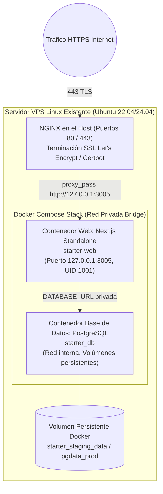

# ADR-005: Orquestación con Docker Compose para Staging y Producción en Servidores Existentes

- **Estado:** ACEPTADO
- **Fecha:** 2026-09-21
- **Perfiles de revisión:** `devops`, `sre`, `infra_data`, `docs`
- **Consultados:** `platform-release-agent`, `security-agent`
- **Referencias:** [`STACK.md`](../../STACK.md), [`Dockerfile`](../../Dockerfile), [`docker-compose.staging.yml`](../../docker-compose.staging.yml), [`docs/operations/enterprise-runbook.md`](../operations/enterprise-runbook.md)

---

## 1. Contexto y Planteamiento del Problema

El despliegue de aplicaciones basadas en **Golden Starter V3** en entornos de pre-producción (Staging) y Producción se lleva a cabo sobre infraestructura existente de servidores virtuales privados (VPS en Ubuntu Linux de proveedores como AWS EC2, Hetzner Cloud o DigitalOcean), los cuales frecuentemente ya cuentan con un servidor **NGINX preinstalado en el host** gestionando certificados TLS/SSL y enrutamiento hacia servicios locales.

Los requerimientos operativos para la orquestación son:

1. **Reproducibilidad y Determinismo:** El stack debe comportarse de forma idéntica en desarrollo local, staging y producción, encapsulando versiones de runtime (Node.js 24, PostgreSQL 18/16).
2. **Bajo Consumo de Recursos del Host:** Los servidores existentes cuentan típicamente con 2 a 4 vCPUs y 4 a 8 GB de memoria RAM. La capa de orquestación no debe consumir recursos desproporcionados en planos de control complejos.
3. **Mínimo Privilegio y Seguridad:** Ejecución estricta con usuarios no-root (`nodejs:nextjs` UID 1001), sin exponer puertos de base de datos a interfaces de red públicas.
4. **Coexistencia con NGINX Existente:** Integración natural con la instalación de NGINX existente en el VPS sin forzar la instalación de proxies alternativos ni alterar la provisión base del sistema operativo.
5. **Operatividad y Recuperación Sencilla:** Procedimientos reproducibles para migraciones, inspección de bitácoras, rotación de secretos y rollback inmediato ante fallos.

---

## 2. Alternativas Consideradas

### 2.1 Opción A: Orquestación con Kubernetes (K8s, K3s, Amazon EKS)

- **Descripción:** Plataforma de orquestación de contenedores distribuida con pods, servicios, ingress controllers y operadores.
- **Razón de Descarte:**
  - **Sobrecarga desproporcionada de recursos:** El plano de control de Kubernetes (kubelet, etcd, kube-apiserver) consume entre 1.5 y 2.5 GB de RAM por sí solo, agotando la capacidad de un VPS estándar antes de iniciar la propia aplicación.
  - **Complejidad operativa excesiva:** Requiere experiencia especializada para gestionar manifiestos YAML complejos, gestión de certificados internas, almacenamiento persistente CSI y solución de problemas de red interna (CNI).

### 2.2 Opción B: Plataformas Serverless / PaaS Gestionadas (Vercel + Neon / AWS Lambda)

- **Descripción:** Alojar la aplicación web en plataformas en la nube completamente administradas y la base de datos en proveedores serverless externos.
- **Razón de Descarte:**
  - **Vendor Lock-in y Costos Impredecibles:** Costos elevados por llamadas serverless recurrentes, transferencias de red y tarifas de base de datos serverless bajo tráfico continuo.
  - **Soberanía y Latencia de Datos:** En entornos corporativos regulados, la residencia local y el control estricto de base de datos en servidores propios o nubes privadas dedicadas es un requisito habitual de auditoría y cumplimiento normativo.
  - **Latencia por Cold Starts:** Las funciones serverless experimentan latencias de arranque en frío que perjudican la experiencia de usuarios de campo que operan bajo condiciones de conectividad móvil intermitente.

### 2.3 Opción C: Ejecución Directa en el Host (Bare-Metal con PM2 y PostgreSQL de Sistema)

- **Descripción:** Instalar Node.js y PostgreSQL directamente mediante paquetes del sistema operativo (`apt install`) y administrar el proceso de Node con PM2.
- **Razón de Descarte:**
  - Desalineación y contaminación de entornos: divergencias de versiones de dependencias del sistema operativo entre la máquina de desarrollo y el servidor de producción.
  - Mayor riesgo de seguridad: menor aislamiento de procesos y mayor complejidad para limitar permisos de sistema de archivos frente a un contenedor con sistema de archivos de solo lectura y usuario no privilegiado.
  - Procesos de rollback manuales y propensos a errores.

### 2.4 Opción D: Forzar Caddy como Proxy Inverso Adicional en Contenedor

- **Descripción:** Incluir un contenedor de Caddy dentro del compose para gestionar SSL automáticamente.
- **Razón de Descarte:**
  - Entra en conflicto con el NGINX existente en el puerto 80/443 del servidor VPS host. Requeriría reconfigurar o desinstalar el NGINX previo del host, lo que generaría fricción operativa innecesaria e interrumpiría otros servicios preexistentes en la máquina.

---

## 3. Decisión Adoptada

Se adopta **Docker Compose (v2 plugin)** como la herramienta de orquestación canónica estándar para staging y producción en los servidores Linux existentes.

### Topología de la Solución:

### Principios y Estándares de Configuración:

1. **Compilación Multi-Stage Segura (`Dockerfile`):**
   - Etapa 1 (`deps`): Instalación de dependencias con `npm ci`.
   - Etapa 2 (`builder`): Compilación con `npm run build:web` generando `.next/standalone`.
   - Etapa 3 (`runner`): Imagen base mínima Alpine Linux, creando usuario no-root `nodejs:nextjs` con UID/GID 1001.
   - Solo se copian los archivos indispensables para runtime, reduciendo drásticamente la superficie de ataque y el tamaño de la imagen.
2. **Aislamiento de Red:**
   - La base de datos PostgreSQL expone su puerto `5432` únicamente a la red interna de Docker o atado exclusivamente a `127.0.0.1` en el host para tareas administrativas de migración.
   - La aplicación web expone su puerto `3005` atado localmente (`127.0.0.1:3005`), impidiendo que peticiones externas evadan el reverse proxy NGINX.
3. **Persistencia Garantizada:**
   - Los datos residen en volúmenes Docker con nombre (`named volumes`), independientes del ciclo de vida de los contenedores.
   - Detener o actualizar los servicios (`docker compose down` sin `-v`) preserva íntegramente los datos y archivos de base de datos.
4. **Comprobación de Salud y Dependencias Sincronizadas:**
   - El servicio `web` define `depends_on: db: condition: service_healthy`.
   - PostgreSQL evalúa salud periódicamente mediante `pg_isready`.
   - El servicio web evalúa salud interna mediante consulta HTTP a `/api/health`.
5. **Integración con NGINX en el Host:**
   - NGINX existente maneja la terminación TLS, compresión gzip, cabeceras HSTS y enruta hacia `http://127.0.0.1:3005`.
   - NGINX sirve la página de mantenimiento programado (HTTP 503) cuando el contenedor se encuentra en ventana de actualización.

---

## 4. Pros y Contras

### Pros

- **Simplicidad Operativa:** Toda la pila se gestiona con comandos estándar y conocidos (`docker compose up -d`, `docker compose down`, `docker compose logs`).
- **Aprovechamiento de la Infraestructura Existente:** Respeta la presencia de NGINX en el VPS sin imponer herramientas conflictivas ni requerir provisión nueva de servidores.
- **Bajo Overhead:** Cero procesos de plano de control dedicados; el motor Docker ejecuta los procesos directamente utilizando los cgroups y namespaces del kernel de Linux.
- **Portabilidad Absoluta:** El archivo `docker-compose.staging.yml` o `docker-compose.prod.yml` puede ejecutarse en cualquier VPS Linux moderno con Docker instalado en cuestión de minutos.

### Contras y Mitigaciones

- **Escalado Horizontal Limitado a un Único Host:** Docker Compose no distribuye contenedores entre múltiples servidores físicos de forma nativa.
  - _Mitigación:_ Para el volumen de carga típico de operaciones empresariales y de campo (cientos a miles de usuarios y transacciones concurrentes), el escalado vertical en VPS (aumento de vCPUs/RAM) y la optimización de queries y caché cubren con holgura la demanda operativa. Si en el futuro se requiriera multi-nodo, la arquitectura desacoplada de contenedores permite migrar a Docker Swarm o K8s sin modificar el código de la aplicación.
- **Actualizaciones con Ventana de Reinicio Breve:** El reinicio del contenedor web puede introducir unos segundos de indisponibilidad si no se aplica rolling update.
  - _Mitigación:_ El Runbook SRE documenta el procedimiento de actualización atómica (`--no-deps web`) y la activación de página de mantenimiento HTTP 503 en NGINX ante migraciones de esquema mayores.

---

## 5. Validación y Conformidad

- **Verificación en Staging:** Validado con `docker compose -f docker-compose.staging.yml up -d` y certificado mediante el endpoint `curl http://127.0.0.1:3005/api/health`.
- **Auditoría de Seguridad de Contenedores:** Aprobada en `docs/security/infrastructure-ci-security-review.md` verificando usuario no privilegiado UID 1001 y ausencia de puertos públicos no autorizados.
