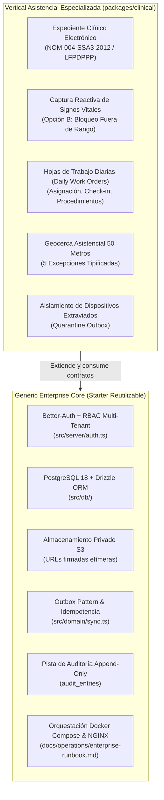
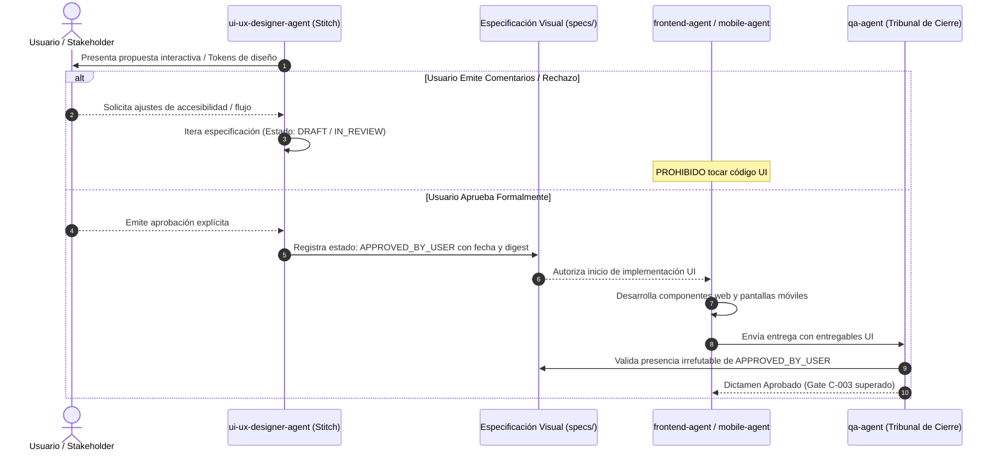
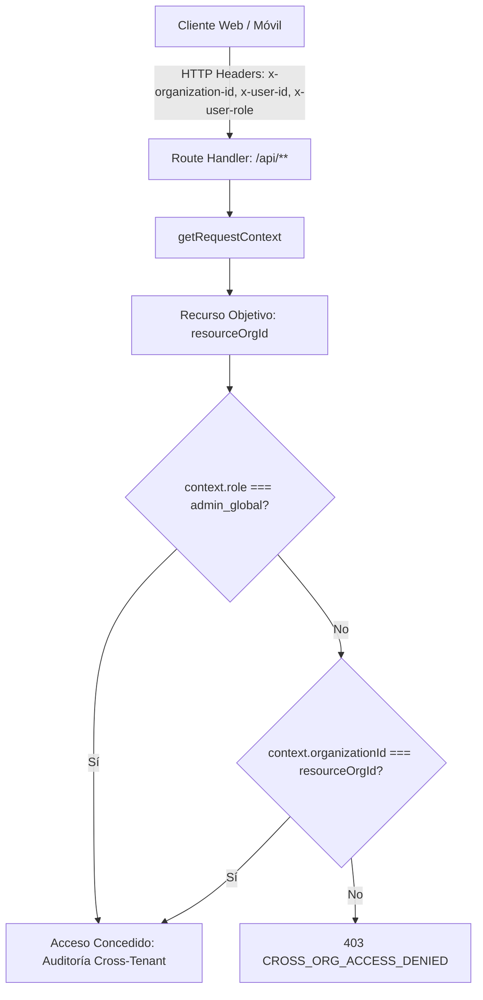
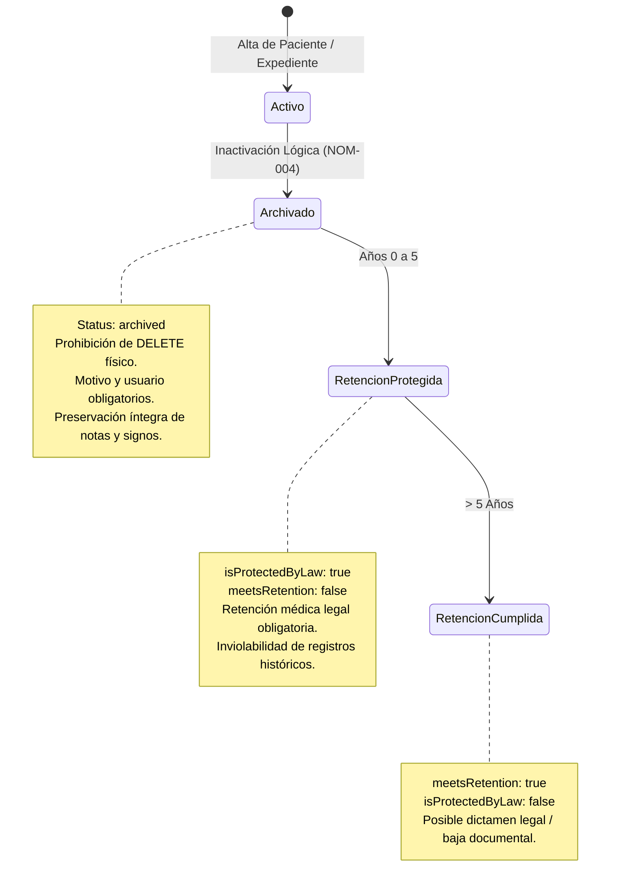
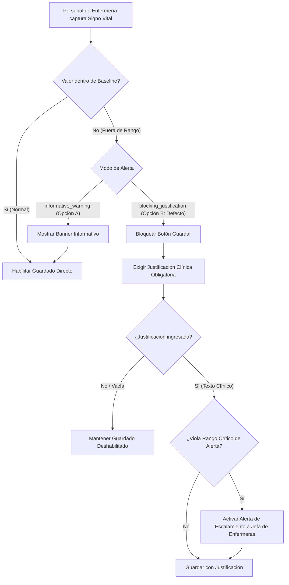
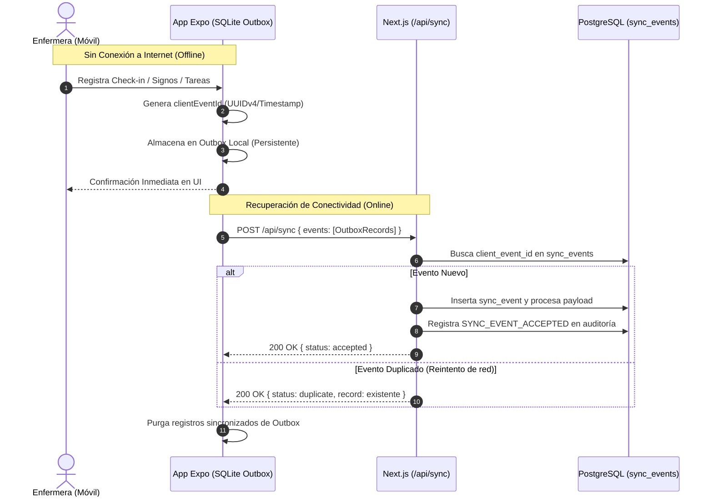
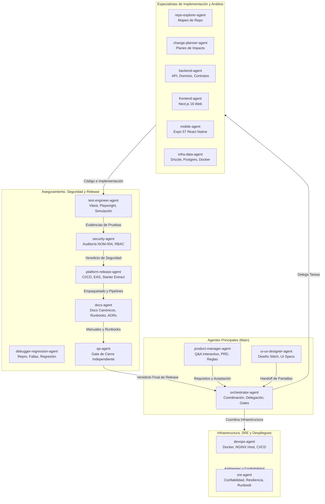

# Manual Canónico de Arquitectura y Gobernanza del Starter

## GS Vera Clinic / CareFlow HomeCare — v1.0.0

- **Versión del Documento:** 1.0.0
- **Fecha de Certificación:** 2026-09-21
- **Base SHA Integrada:** `18c101c`
- **Estado:** CANÓNICO (Aprobado para Gobernanza y Operaciones)
- **Autor y Mantenedores:** `docs-agent` en coordinación con `orchestrator-agent`, `sre-agent` y `devops-agent`
- **Referencias Base:** [`golden-starter.manifest.json`](../../golden-starter.manifest.json), [`STACK.md`](../../STACK.md), [`ARCHITECTURE.md`](../../ARCHITECTURE.md), [`docs/adr/README.md`](../adr/README.md), [`docs/operations/enterprise-runbook.md`](../operations/enterprise-runbook.md)

---

## 1. Visión General del Monorepo

El **Golden Starter GS Vera Clinic / CareFlow HomeCare v1.0.0** es un monorepo TypeScript integral de grado empresarial diseñado con una **arquitectura estrictamente desacoplada** entre el núcleo genérico del starter corporativo (_Generic Enterprise Core_) y la vertical asistencial de salud (_packages/clinical_). Esta separación permite reutilizar la base técnica multi-tenant, segura y offline-first en diversas industrias, mientras aísla las reglas de negocio médico, expedientes NOM-004 y flujos de enfermería en módulos especializados.

### 1.1 Estructura de Espacios de Trabajo (Workspaces)

El repositorio está estructurado mediante npm workspaces en torno a componentes desacoplados:

```
careflow-homecare/ (gs-vera-clinic)
├── apps/
│   └── mobile/                 # Aplicación móvil Expo SDK 57 / React Native
├── packages/
│   ├── contracts/              # Contratos y esquemas Zod puros compartidos (cero dependencias server)
│   └── clinical/               # Dominio clínico especializado (NOM-004, vitals, work-orders)
├── src/                        # Núcleo Web Next.js 16 (App Router) y APIs
│   ├── app/                    # Rutas de interfaz web y Route Handlers (/api/**)
│   ├── components/             # Componentes de UI (compartidos y modulares)
│   ├── db/                     # Esquemas Drizzle ORM y conexión PostgreSQL
│   ├── domain/                 # Lógica de dominio y servicios del starter
│   └── server/                 # Contexto de autenticación, control de acceso RBAC y errores
├── drizzle/                    # Migraciones relacionales PostgreSQL versionadas
├── docs/                       # Documentación técnica, ADRs canónicos y runbooks SRE
│   ├── adr/                    # Suite formal de Decisiones de Arquitectura (ADR-001 a ADR-005)
│   ├── architecture/           # Guías de arquitectura y gobernanza del starter
│   └── operations/             # Runbooks operativos SRE y staging
├── scripts/                    # Utilidades de verificación, simulación y extracción
└── .agents/                    # Catálogo local de 17 agentes Antigravity y habilidades SRE
```

### 1.2 Pila Tecnológica Canónica

Conforme a la fuente de verdad técnica estipulada en [`STACK.md`](../../STACK.md) y certificada en [`golden-starter.manifest.json`](../../golden-starter.manifest.json), los componentes y versiones exactas del runtime son:

| Componente             | Tecnología              | Versión Certificada         | Rol en el Sistema                                       |
| :--------------------- | :---------------------- | :-------------------------- | :------------------------------------------------------ |
| **Runtime Base**       | Node.js                 | `>=24 <25` (LTS)            | Motor de ejecución del servidor, scripts y pipelines    |
| **Gestor de Paquetes** | npm                     | `>=11 <12`                  | Resolución de dependencias y orquestación de workspaces |
| **Web Framework**      | Next.js                 | `16.3.5`                    | App Router, Server Components y Route Handlers          |
| **Web UI**             | React / React DOM       | `19.2.0`                    | Biblioteca de componentes web interactivos              |
| **Estilos Web**        | Tailwind CSS            | `4.1.0`                     | Motor de utilidades CSS integrado con PostCSS           |
| **Mobile Runtime**     | Expo SDK / React Native | `57.0.24` / `RN 0.86.3`     | Aplicación móvil nativa para Android e iOS              |
| **Mobile Router**      | Expo Router             | `57.0.22`                   | Navegación basada en sistema de archivos                |
| **Motor JS Móvil**     | Hermes Engine           | Integrado SDK 57            | Bytecode optimizado para arranque rápido en móviles     |
| **Base de Datos**      | PostgreSQL              | `18` (Dev) / `16` (Staging) | Motor relacional transaccional persistente ACID         |
| **ORM / Migraciones**  | Drizzle ORM / Kit       | `0.45.2` / `0.31.10`        | Modelado relacional tipado y generación de SQL          |
| **Autenticación**      | Better-Auth             | `1.7.5`                     | Autenticación multi-rol, control de sesiones y tokens   |
| **Contratos de Datos** | Zod                     | `4.6.5`                     | Esquemas de validación e inferencia de tipos estáticos  |
| **Pruebas de Lógica**  | Vitest                  | `2.1.9`                     | Suite de pruebas unitarias y de integración rápida      |
| **Pruebas Web E2E**    | Playwright              | `1.63.0`                    | Automatización de flujos de usuario extremo a extremo   |
| **Contenedores**       | Docker / Compose        | Docker Engine 26+ / v2      | Contenedorización multi-stage y orquestación local      |

---

### 1.3 Arquitectura Desacoplada del Starter: Core Genérico vs. packages/clinical

Para garantizar máxima modularidad, el repositorio establece una frontera nítida entre los cimientos reutilizables de grado empresarial y la lógica de negocio asistencial:



#### Responsabilidades de Cada Capa:

1. **Núcleo Genérico Empresarial (_Generic Enterprise Core_):**

   - **Autenticación y Sesiones:** Gestión autónoma con Better-Auth, sesiones con cookies `HttpOnly`, soporte para clientes móviles con almacenamiento seguro nativo y control RBAC.
   - **Aislamiento Multi-Tenant:** Filtrado estricto por `organization_id` en todas las consultas y aserción de tenant en Route Handlers (`assertOrganizationAccess`).
   - **Almacenamiento Protegido S3:** Subida y descarga de archivos privados mediante URLs temporales prefirmadas (ADR-004), sin almacenamiento en disco de contenedor ni buckets públicos.
   - **Sincronización Offline e Idempotencia:** Deduplicación por `clientEventId`, soporte de reintentos seguros sin corrupción de estado y cola outbox local.
   - **Auditoría Inmutable:** Registro append-only en `audit_entries` con metadatos JSONB para trazabilidad legal y forense.
   - **Infraestructura y Confiabilidad:** Orquestación con Docker Compose v2 (ADR-005) adaptada a VPS existente con NGINX en el host, comprobación de salud en `/api/health` y manuales SRE.

2. **Módulo Clínico Especializado (_packages/clinical_ y Vertical Asistencial):**
   - **Expediente NOM-004-SSA3-2012:** Políticas de retención obligatoria de 5 años, archivado lógico inmutable y prohibición de borrado físico (`DELETE`).
   - **Flujos de Atención en Turno:** Asignación de turnos, check-in/check-out con geocerca perimetral de 50 metros y excepciones documentadas.
   - **Monitoreo de Signos Vitales:** Reglas de validación clínica en tiempo real que impiden registrar signos alterados sin justificación médica (Opción B).
   - **Cuarentena de Dispositivos de Campo:** Aislamiento de paquetes de sincronización ante pérdida o robo de teléfonos móviles.

---

### 1.4 Gobernanza de Diseño: Regla Mandatoria de Aprobación de Interfaces

Para erradicar discrepancias entre el diseño visual acordado y la implementación en código, rige la siguiente directriz institucional inquebrantable:

> [!CAUTION] > **REGLA OBLIGATORIA DE GOBERNANZA DE DISEÑO (GATE VISUAL)** > **Los equipos de Frontend (`frontend-agent`) y Mobile (`mobile-agent`) tienen ESTRICTAMENTE PROHIBIDO implementar interfaces de usuario (web o móvil) sin una especificación visual con estado explícito `APPROVED_BY_USER` emitido formalmente por el usuario.** > **EL SILENCIO NUNCA ES APROBACIÓN.**

#### Flujo Operativo del Gate de Diseño:



1. **Prohibición de Supuestos:** Si el usuario no responde a una propuesta de diseño, la tarea permanece en espera. Ningún agente puede inferir aprobación tácita o avanzar bajo asunciones técnicas.
2. **Rechazo Automático en QA:** Cualquier Pull Request o artefacto de entrega que introduzca cambios visuales sin vincular a un documento en `specs/` con estado `APPROVED_BY_USER` será inmediatamente rechazado por `qa-agent` bajo el criterio C-003.

---

## 2. Patrones Clave de Arquitectura

El diseño de CareFlow HomeCare implementa seis patrones fundamentales que garantizan aislamiento, seguridad, cumplimiento legal y experiencia continua sin red.

### 2.1 Aislamiento Multi-Tenant Estricto (`organizationId`)

El sistema es multi-empresa (_multi-tenant_) por diseño. Ninguna organización proveedora de servicios médicos puede visualizar, mutar ni sincronizar expedientes, órdenes o dispositivos que pertenezcan a otra entidad.



#### Reglas de Aislamiento en Datos y Código:

1. **Clave Foránea Obligatoria:** Todas las tablas de datos de negocio en `src/db/schema.ts` (`users`, `patients`, `shifts`, `carePlans`, `dailyWorkOrders`, `serviceRequests`, `procedureCatalog`, `certifications`, `staffCapabilities`, `vitalSignsRecords`, `devices`, `syncEvents`, `auditEntries`) definen `organizationId: uuid("organization_id").notNull().references(() => organizations.id)`.
2. **Resolución de Contexto (`src/server/auth.ts`):** La función `getRequestContext(request)` extrae la identidad del llamador aplicando el orden de precedencia:
   - Cabecera HTTP `x-organization-id`
   - Parámetro de consulta `?organizationId=`
   - Fallback configurado por la aplicación (`org-demo-001` en modo piloto)
3. **Control por Objeto (`assertOrganizationAccess`):** Antes de retornar o persistir un recurso, el Route Handler evalúa:
   ```typescript
   export function assertOrganizationAccess(context: RequestContext, resourceOrgId: string): void {
     if (context.role === "admin_global") return; // Supervisión cross-tenant controlada
     if (context.organizationId !== resourceOrgId) {
       throw new ApiHttpError(403, "CROSS_ORG_ACCESS_DENIED", `Access denied...`);
     }
   }
   ```
4. **Validación de Lotes de Sincronización:** En `POST /api/sync`, si el payload de un evento contiene un identificador de organización explícito o un dispositivo registrado, se valida su correspondencia contra el tenant del llamador.

---

### 2.2 Separación Estricta de Contratos Zod Puros (`packages/contracts`)

Para evitar acoplamientos indeseados entre el backend web y el cliente móvil, todos los esquemas de datos serializables residen exclusivamente en el espacio de trabajo `packages/contracts`.

#### Invariantes del Paquete de Contratos:

- **Cero Dependencias de Plataforma:** El paquete sólo depende de `zod`. Está estrictamente prohibido importar módulos de servidor (`fs`, `path`, `crypto`, Drizzle ORM, Better-Auth) o módulos nativos de React/Expo.
- **Tipado Unidireccional e Inferido:** Los tipos TypeScript de dominio (`Patient`, `Shift`, `DailyWorkOrder`, `VitalSignRecord`, `SyncEvent`, `Device`, etc.) se generan automáticamente a través de `z.infer<typeof schema>`.
- **Estandarización de Respuestas de Error:** Todas las fallas HTTP implementan el contrato `apiErrorResponseSchema`:
  ```typescript
  {
    code: string,
    message: string,
    details?: unknown,
    requestId: string
  }
  ```
- **Refinamiento de Validación Cruzada (`superRefine`):** Las reglas complejas (tales como la congruencia de fechas de vencimiento de certificaciones o la exigencia de justificación clínica) se validan directamente en el contrato de entrada.

---

### 2.3 Gobernanza Clínica NOM-004-SSA3-2012 y LFPDPPP

El manejo de información clínica de pacientes está sujeto a la legislación mexicana para expedientes clínicos electrónicos (NOM-004-SSA3-2012 / NOM-024-SSA3-2012) y la Ley Federal de Protección de Datos Personales en Posesión de los Particulares (LFPDPPP).



#### Directrices Normativas Implementadas:

1. **Cero Borrado Físico (No DELETE):**
   - Las tablas clínicas carecen de operaciones `DELETE` en Route Handlers y modelos de dominio.
   - Las solicitudes de baja de servicio o ejercicio de derechos ARCO de cancelación conducen a un archivado lógico con congelamiento de estado.
2. **Archivado Lógico con Trazabilidad (`validateArchivePatient`):**
   - Implementado en `src/domain/retention.ts`. Exige identificador de usuario (`archivedBy`), marca temporal UTC (`archivedAt`) y motivo justificado (`archiveReason`).
   - El endpoint `POST /api/patients/:id/archive` persiste estos metadatos y crea una entrada inmutable en `audit_entries`.
3. **Retención Legal Obligatoria de 5 Años:**
   - La constante `NOM_004_RETENTION_YEARS = 5` rige el cálculo del ciclo de vida del expediente.
   - La función `checkRetentionPolicy(createdAt, now)` y su detalle `getRetentionPolicyDetails` evalúan la antigüedad exacta del expediente. Si `yearsElapsed < 5`, el expediente se cataloga como protegido por ley (`isProtectedByLaw: true`), impidiendo cualquier purga de la base de datos.
4. **Restricción Estricta de Exportación Clínica (RBAC):**
   - La generación y descarga del expediente clínico resumido o completo (`POST /api/patients/:id/export`) está restringida exclusivamente a dos roles mediante `isAllowedClinicalExportRole`:
     - `clinical_lead` (Jefa de Enfermeras / Dirección Médica)
     - `admin_global` (Administrador de Cumplimiento)
   - Cualquier intento de exportación por parte de enfermeras operativas, cuidadoras, coordinadores o supervisores es rechazado con `403 FORBIDDEN`.
5. **Cumplimiento LFPDPPP (Datos Personales Sensibles):**
   - Prohibición de persistir registros de pacientes reales durante fases de prueba o staging; todos los fixtures son sintéticos.
   - Minimización de datos en telemetría: la bitácora `audit_entries` registra únicamente eventos de control sin duplicar descripciones clínicas sensibles.

---

### 2.4 Reglas de Negocio Reactivas: Opción B (Bloqueo por Signos Fuera de Rango)

Durante el registro clínico de signos vitales (temperatura, tensión arterial sistólica/diastólica, frecuencia cardíaca, saturación de oxígeno SpO2 y glucemia), el sistema aplica el modelo reactivo conocido como **Opción B**.



#### Especificación de Rangos y Validación:

- **Rangos Basales Estándar (`STANDARD_VITAL_RANGES`):**
  - Temperatura: 36.0 °C – 37.5 °C (Alerta crítica: < 35.5 °C ó > 37.5 °C)
  - TA Sistólica: 90 mmHg – 120 mmHg (Alerta crítica: < 90 mmHg ó > 139 mmHg)
  - TA Diastólica: 60 mmHg – 80 mmHg (Alerta crítica: < 60 mmHg ó > 89 mmHg)
  - SpO2: 94 % – 100 % (Alerta crítica: < 94 %)
  - Frecuencia Cardíaca: 60 lpm – 100 lpm (Alerta crítica: < 50 lpm ó > 100 lpm)
  - Glucosa: 70 mg/dL – 140 mg/dL (Alerta crítica: < 70 mg/dL ó > 180 mg/dL)
- **Dominio (`src/domain/vitals.ts`):** La función `evaluateVitalSign` retorna `{ isOutOfRange, requiresJustification, shouldEscalate }`.
- **Contrato de Servidor (`recordVitalSignInputSchema`):** La validación Zod `superRefine` rechaza peticiones HTTP con error 400 si `isOutOfRange === true` bajo `blocking_justification` y no se acompaña de una `justification` con texto válido.
- **Componente Móvil (`VitalsBottomSheet.tsx`):** La hoja modal bloquea reactivamente la acción del usuario mostrando un campo de texto con resaltado de advertencia y deshabilitando el botón de confirmación hasta registrar la justificación médica.

---

### 2.5 Arquitectura Offline-First: Outbox, Idempotencia y Geocerca de 50 Metros

El entorno de trabajo de la enfermera domiciliaria suele presentar cortes severos de cobertura celular (sótanos, zonas suburbanas, client isolation en redes Wi-Fi residenciales). La arquitectura está diseñada para operar con independencia total de red.



#### Mecanismos de Resiliencia:

1. **Outbox Local Desacoplado:** Toda interacción clínica genera un registro con `clientEventId`, tipo de evento (`attendance`, `task`, `vital_sign`, `procedure`, `work_order`), marca temporal de captura `occurredAt` y datos asociados.
2. **Deduplicación e Idempotencia:**
   - La tabla de base de datos `sync_events` define un índice único sobre `client_event_id`.
   - La función `acceptIdempotentEvent` (`src/domain/sync.ts`) detecta transmisiones repetidas originadas por fallos en la confirmación TCP/HTTP y retorna la referencia previa sin crear registros espurios ni duplicar asientos de auditoría.
3. **Geocerca Perimetral de 50 Metros con Excepciones:**
   - Implementada mediante cálculo trigonométrico de Haversine (`src/domain/geofence.ts`).
   - El radio de atención estándar es de 50 metros respecto a las coordenadas geográficas del domicilio del paciente (`geofenceRadiusMeters: 50`).
   - Se evalúa la precisión del sensor satelital del teléfono (`accuracyMeters <= 50m`). Si el sensor presenta baja precisión (> 100m) o el teléfono se sitúa fuera de los 50 metros, se bloquea el check-in directo y se abre obligatoriamente el diálogo de **Excepción de Geocerca**.
   - **Catálogo de 5 Excepciones Tipificadas:**
     1. _Dirección física inexacta o acceso con portón perimetral cerrado._
     2. _Urgencia médica atendida de inmediato en la entrada del domicilio._
     3. _Intermitencia de señal o baja precisión del sensor GPS (satélites)._
     4. _Acompañamiento del paciente en traslado o ambulancia._
     5. _Domicilio temporal de familiar previamente comunicado a coordinación._
   - **Invariante Operativo:** No se permite realizar check-out sin haber verificado previamente el check-in de inicio de turno.

---

### 2.6 Catálogo y Coreografía de los 17 Agentes Locales Antigravity

El desarrollo, mantenimiento y gobernanza del proyecto está orquestado por un ecosistema de **17 agentes inteligentes locales** de Google Antigravity, configurados de manera no intrusiva en `.agents/agents/` sin requerir instalación global ni modificar `~/.gemini/config/agents`.



#### Catálogo Oficial de Agentes:

|   #    | Nombre del Agente           | Rol Operativo                                                                           | Política de Shell      | Herramientas Asignadas                                                               | Habilidades (Skills)           |
| :----: | :-------------------------- | :-------------------------------------------------------------------------------------- | :--------------------- | :----------------------------------------------------------------------------------- | :----------------------------- |
| **1**  | `orchestrator-agent`        | Coordinación general del flujo, DAG de tareas, integración y aplicación de gates.       | `sandbox`              | `view_file`, `grep_search`, `replace_file_content`, `run_command`, `invoke_subagent` | —                              |
| **2**  | `product-manager-agent`     | Conduce sesiones live de producto, traduce decisiones a PRD sin supuestos clínicos.     | `off` (Solo docs)      | `view_file`, `grep_search`, `replace_file_content`                                   | `skills/live-product-qa`       |
| **3**  | `ui-ux-designer-agent`      | Diseña interfaces web y mobile con tokens clínicos; gestiona aprobaciones con Stitch.   | `off` (Solo specs)     | `view_file`, `grep_search`, `replace_file_content`                                   | `skills/live-design-review`    |
| **4**  | `repo-explorer-agent`       | Explora y mapea estructura de archivos, módulos y dependencias de forma pasiva.         | `off` (Lectura)        | `view_file`, `grep_search`                                                           | —                              |
| **5**  | `change-planner-agent`      | Genera planes de cambio atómicos, secuenciales y con estimación de impacto.             | `off` (Solo artifacts) | `view_file`, `grep_search`, `replace_file_content`                                   | —                              |
| **6**  | `frontend-agent`            | Desarrolla la aplicación web Next.js 16 con App Router, React 19 y Tailwind CSS 4.      | `sandbox`              | `view_file`, `grep_search`, `replace_file_content`, `run_command`                    | —                              |
| **7**  | `mobile-agent`              | Desarrolla la app nativa Expo 57 / React Native, navegación y sincronización offline.   | `sandbox`              | `view_file`, `grep_search`, `replace_file_content`, `run_command`                    | —                              |
| **8**  | `backend-agent`             | Implementa contratos Zod, Route Handlers, servicios de dominio y control RBAC.          | `sandbox`              | `view_file`, `grep_search`, `replace_file_content`, `run_command`                    | —                              |
| **9**  | `infra-data-agent`          | Gestiona esquemas Drizzle, PostgreSQL, migraciones, Dockerfile y docker-compose.        | `sandbox`              | `view_file`, `grep_search`, `replace_file_content`, `run_command`                    | —                              |
| **10** | `test-engineer-agent`       | Construye y ejecuta suites Vitest, Playwright y arneses de red simulada.                | `sandbox`              | `view_file`, `grep_search`, `replace_file_content`, `run_command`                    | —                              |
| **11** | `debugger-regression-agent` | Reproduce bugs, aísla causa raíz y escribe pruebas de regresión automatizadas.          | `sandbox`              | `view_file`, `grep_search`, `replace_file_content`, `run_command`                    | —                              |
| **12** | `security-agent`            | Audita cumplimiento NOM-004, LFPDPPP, control de secretos, CI y hardening.              | `sandbox`              | `view_file`, `grep_search`, `replace_file_content`, `run_command`                    | —                              |
| **13** | `docs-agent`                | Produce documentación canónica, runbooks de operación y guías de arquitectura.          | `sandbox`              | `view_file`, `grep_search`, `replace_file_content`, `run_command`                    | —                              |
| **14** | `platform-release-agent`    | Administra dependencias compartidas, pipelines de CI/CD, EAS y empaquetado del starter. | `sandbox`              | `view_file`, `grep_search`, `replace_file_content`, `run_command`                    | —                              |
| **15** | `qa-agent`                  | Actúa como tribunal de cierre independiente, auditando evidencia sin modificar código.  | `off` (Solo lectura)   | `view_file`, `grep_search`                                                           | —                              |
| **16** | `devops-agent`              | Diseña empaquetado Docker, Compose, proxy inverso NGINX host y pipelines CI/CD.         | `sandbox`              | `view_file`, `grep_search`, `replace_file_content`, `run_command`                    | `skills/production-deployment` |
| **17** | `sre-agent`                 | Responsable de confiabilidad, monitoreo de salud, mitigación de saturación y runbooks.  | `sandbox`              | `view_file`, `grep_search`, `replace_file_content`, `run_command`                    | —                              |

#### Protocolo de Comunicación y Handoff (Envelope v1):

Cada agente reporta su entrega mediante la estructura definida en [`docs/contrato-resultados.md`](../contrato-resultados.md):

- `schema_version`: "1.0"
- `task_id` / `run_id` / `agent_id`
- `evaluated_ref`: SHA del commit base evaluado
- `status`: `COMPLETED` | `FAILED` | `BLOCKED`
- `verdict`: `APPROVED` | `APPROVED_WITH_RESERVATIONS` | `REJECTED` | `NOT_APPLICABLE`
- `files_changed` y `deliverables`
- `checks`: Matriz de comandos ejecutados con exit_code, evidencia y estado
- `blockers` y `next_action`

---

## 3. Suite Formal de Decisiones de Arquitectura (ADRs) y Runbooks

Las directrices técnicas fundamentales del sistema están formalizadas en registros inmutables de decisión arquitectónica ([`docs/adr/README.md`](../adr/README.md)) y manuales de resiliencia operativa:

1. **[`ADR-001: Adopción Directa de Next.js`](../adr/ADR-001-direct-nextjs.md):** Justificación de App Router, React Server Components (RSC) y Route Handlers sin capas intermedias.
2. **[`ADR-002: PostgreSQL 18 como Motor Relacional Primario`](../adr/ADR-002-postgresql-18.md):** Transaccionalidad ACID estricta, JSONB nativo y extensiones enterprise.
3. **[`ADR-003: Better Auth para Autenticación Multi-Tenant`](../adr/ADR-003-better-auth.md):** Autenticación autónoma autohospedada sin costos recurrentes ni vendor lock-in.
4. **[`ADR-004: Almacenamiento Privado S3 con URLs Firmadas`](../adr/ADR-004-private-s3-storage.md):** Aislamiento de documentos médicos sensibles con URLs efímeras protegidas por RBAC.
5. **[`ADR-005: Orquestación con Docker Compose en Servidores Existentes`](../adr/ADR-005-docker-compose-orchestration.md):** Despliegue determinista y desacoplado coordinado con NGINX en el host.
6. **[`Runbook Operativo SRE`](../operations/enterprise-runbook.md):** Manual completo de contingencias (_too many clients_, saturación de disco, página de mantenimiento HTTP 503 en NGINX y rollback).
