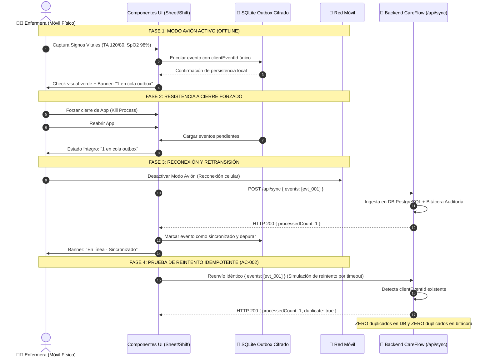

# Guía de Verificación y Pruebas de Campo en Dispositivos Físicos (T-027)

> **Módulo:** CareFlow HomeCare — Aplicación Móvil de Enfermería  
> **Plataformas:** Dispositivos móviles físicos Android (APK independiente EAS) e iOS (Development Build)  
> **Normativa de Referencia:** NOM-004-SSA3-2012 (Expediente Clínico Electrónico), NOM-024-SSA3-2012 (Sistemas de Información de Registro Electrónico para la Salud), HIPAA/GDPR  
> **Criterios de Aceptación Cubiertos:** AC-001, AC-002, AC-003, AC-006, AC-007, AC-012  
> **Herramientas:** Arnés de simulación de red `scripts/simulate-mobile-network.mjs`, EAS Build CLI, ADB, ngrok, Vitest

---

## 1. Propósito y Alcance

Esta guía establece el protocolo formal y los procedimientos operativos para la ejecución de pruebas de campo en **dispositivos físicos reales** de enfermería domiciliaria. Los simuladores de escritorio no reproducen con fidelidad los desafíos de hardware y entorno clínico:

- Intermitencia y cambio dinámico entre redes celulares 3G/4G/5G y Wi-Fi doméstico.
- Degradación de precisión satelital GPS en interiores de hormigón y sótanos.
- Pérdida transitoria de conectividad durante la captura de signos vitales.
- Gestión de energía del sistema operativo que suspende procesos en segundo plano.
- Restricciones de seguridad por hardware (TEE, Keystore, Secure Enclave).

### 1.1 Requisitos de Hardware para Pruebas

| Plataforma  | Requisito Mínimo                                    | Requisito Recomendado                | Sensores Requeridos                                   |
| :---------- | :-------------------------------------------------- | :----------------------------------- | :---------------------------------------------------- |
| **Android** | Android 11 (API 30), 3 GB RAM, 16 GB almacenamiento | Android 13/14 (API 33/34), 4+ GB RAM | GPS + GLONASS/Galileo, Acelerómetro, Cámara (para QR) |
| **iOS**     | iOS 16.0, iPhone SE (2da gen) o iPhone 11           | iOS 17+, iPhone 13/14/15             | GPS Asistido, Biometría (Face ID/Touch ID)            |

> [!IMPORTANT] > **Datos Clínicos Ficticios:** En cumplimiento estricto con las políticas de privacidad médica y el plan `docs/QUALITY.md`, todas las pruebas en campo deben ejecutarse exclusivamente con pacientes, enfermeras y direcciones **sintéticas y ficticias** (ej. _Sra. Elena Morales Rivera_, _Enf. Valeria Méndez_, _org-demo-001_). Jamás deben ingresarse identificadores personales reales de pacientes o personal médico.

---

## 2. Configuración de Red para Pruebas de Campo

Para que un dispositivo móvil físico se comunique con el backend local o el entorno de pruebas, es necesario establecer un canal de comunicación IP bidireccional libre de bloqueos perimetrales.

### 2.1 Conexión LAN Local Directa

Si la estación de desarrollo y el smartphone se encuentran en la misma red Wi-Fi local sin restricciones:

1. **Obtener la dirección IP local de la computadora anfitriona:**

   - **macOS:**
     ```bash
     ipconfig getifaddr en0   # Si está conectado por Wi-Fi
     ipconfig getifaddr en1   # Si está conectado por Ethernet
     ```
   - **Linux:**
     ```bash
     hostname -I | awk '{print $1}'
     ```
   - **Windows:**
     ```powershell
     (Get-NetIPAddress -AddressFamily IPv4 -InterfaceAlias "Wi-Fi").IPAddress
     ```

2. **Configurar el servidor backend para escuchar en todas las interfaces (`0.0.0.0`):**

   ```bash
   PORT=3000 HOST=0.0.0.0 npm run dev
   ```

3. **Verificar conectividad básica desde el navegador del dispositivo móvil:**
   Abra el navegador móvil (Chrome o Safari) e ingrese:
   ```text
   http://<IP_HOST_LAN>:3000/api/health
   ```
   **Respuesta esperada (HTTP 200):**
   ```json
   { "status": "healthy", "service": "careflow-homecare", "timestamp": "2026-09-21T..." }
   ```

### 2.2 Apertura de Firewall y Puertos

Si el dispositivo móvil reporta `ERR_CONNECTION_TIMED_OUT` o no responde, verifique la configuración de cortafuegos:

- **macOS:**
  En _Ajustes del Sistema > Red > Firewall_, verifique que Node.js tenga permitido recibir conexiones entrantes, o deshabilite temporalmente el bloqueo de conexiones entrantes furtivas.
- **Linux (UFW):**
  ```bash
  sudo ufw allow 3000/tcp comment 'CareFlow Next.js API'
  sudo ufw allow 8081/tcp comment 'CareFlow Network Simulation Proxy'
  sudo ufw reload
  ```
- **Windows Defender Firewall:**
  ```powershell
  New-NetFirewallRule -DisplayName "CareFlow Dev Server" -Direction Inbound -LocalPort 3000,8081 -Protocol TCP -Action Allow
  ```

### 2.3 Redes con Aislamiento de Clientes (AP Client Isolation)

En muchas redes corporativas, clínicas, hospitales o cafeterías, los puntos de acceso Wi-Fi tienen activado el **Aislamiento de Clientes (Client / Station Isolation)**. Esta medida de seguridad bloquea el tráfico de igual a igual (P2P / LAN), impidiendo que el teléfono se comunique directamente con la IP de la laptop aunque ambos compartan la misma contraseña Wi-Fi.

#### Solución: Túnel Seguro con ngrok

1. **Iniciar el túnel HTTPS apuntando al puerto del servidor:**
   ```bash
   ngrok http 3000 --host-header="localhost:3000"
   ```
2. **Copiar la URL pública generada:**
   ```text
   Forwarding: https://c7b2-187-190-22-10.ngrok-free.app -> http://localhost:3000
   ```
3. **Configurar la aplicación móvil:**
   En el archivo de entorno de la aplicación móvil (`apps/mobile/.env.staging` o variables de Expo):
   ```ini
   EXPO_PUBLIC_API_URL=https://c7b2-187-190-22-10.ngrok-free.app/api
   ```
   > [!TIP]
   > Si ngrok despliega la pantalla de advertencia preliminar en solicitudes de API, incluya la cabecera `ngrok-skip-browser-warning: true` en el interceptor de red de la aplicación móvil.

#### Alternativa: Zona Wi-Fi Portátil (Mobile Hotspot)

Si no se dispone de conexión a Internet o se desea una red 100% controlada sin restricciones perimetrales:

1. Active la función **Zona Wi-Fi Móvil (Mobile Hotspot)** en el teléfono Android o iPhone.
2. Conecte la laptop de desarrollo a dicha red Wi-Fi emitida por el teléfono.
3. El teléfono asigna a la laptop una IP del rango `192.168.43.x` (Android) o `172.20.10.x` (iOS). La comunicación LAN directa queda inmediatamente habilitada sin aislamiento.

---

## 3. Sideloading e Instalación de APK de Prueba (EAS Preview)

Para validar la experiencia real de la enfermera sin depender de los tiempos de revisión de Google Play Store ni de TestFlight, se utiliza el perfil `preview` configurado en `apps/mobile/eas.json`.

### 3.1 Anatomía del Perfil `preview`

A diferencia del perfil `production` (que genera un paquete `.aab` para la tienda), el perfil `preview` genera un binario ejecutable `.apk` independiente:

```json
{
  "build": {
    "preview": {
      "channel": "staging",
      "distribution": "internal",
      "android": {
        "buildType": "apk"
      },
      "ios": {
        "simulator": true
      }
    }
  }
}
```

### 3.2 Generación del Binario APK

Ejecute la compilación mediante EAS CLI:

- **Compilación en EAS Cloud:**
  ```bash
  npx eas-cli build --profile preview --platform android
  ```
- **Compilación Local (mediante Docker/Android SDK local sin gastar créditos en la nube):**
  ```bash
  npx eas-cli build --profile preview --platform android --local
  ```

El artefacto resultante tendrá la nomenclatura `careflow-homecare-preview.apk`.

### 3.3 Preparación del Dispositivo Android Físico

1. **Activar Opciones para Desarrolladores:**
   - Ingrese a _Ajustes > Acerca del teléfono > Información de software_.
   - Toque 7 veces consecutivas sobre **Número de compilación** hasta ver el mensaje: _"¡Ahora eres un desarrollador!"_.
2. **Activar Depuración por USB:**
   - Ingrese a _Ajustes > Opciones para desarrolladores_.
   - Habilite el interruptor **Depuración por USB (USB Debugging)**.
   - Conecte el dispositivo a la computadora por cable USB-C y acepte la clave RSA en la pantalla del teléfono: _"Permitir siempre desde esta computadora"_.
3. **Habilitar Instalación de Aplicaciones Desconocidas:**
   - Ingrese a _Ajustes > Aplicaciones > Acceso especial > Instalar aplicaciones desconocidas_.
   - Autorice al gestor de archivos o navegador móvil utilizado para descargar el archivo.

### 3.4 Procedimiento de Sideloading

#### Método A: Sideloading mediante ADB (Recomendado)

1. Verifique que el dispositivo esté detectado por ADB:
   ```bash
   adb devices
   ```
   _Salida esperada:_
   ```text
   List of devices attached
   RF8N90XXXXX    device
   ```
2. Instale el APK sobreescribiendo versiones previas y manteniendo datos de prueba:
   ```bash
   adb install -r -d ./careflow-homecare-preview.apk
   ```
   _Salida esperada:_
   ```text
   Performing Streamed Install
   Success
   ```

#### Método B: Descarga Directa y Gestión de Google Play Protect

1. Transfiera el APK al almacenamiento interno del teléfono o descárguelo escaneando el código QR generado por EAS Build.
2. Abra el archivo APK desde la barra de notificaciones o la aplicación _Mis Archivos_.
3. Si el diálogo del sistema de Google Play Protect muestra:
   > _"Bloqueado por Play Protect: Esta app es de un desarrollador no reconocido"_
4. Pulse en **Más detalles** y seleccione **Instalar de todos modos (unsafe)**.
5. Verifique la integridad del binario comprobando la huella digital criptográfica SHA-256 antes de iniciar la sesión de prueba:
   ```bash
   shasum -a 256 careflow-homecare-preview.apk
   ```

---

## 4. Matriz de Prueba de Geocerca GPS Real (NOM-004 / AC-003)

La **NOM-004-SSA3-2012** exige certificar la presencia física del profesional de salud en el domicilio del paciente durante la atención para dar plena validez legal y médica a las notas de enfermería.

CareFlow HomeCare aplica una regla estricta:

- Radio predeterminado: **50 metros** alrededor de las coordenadas geográficas del paciente.
- Parámetro de tolerancia y precisión satelital: Precisión del sensor (`accuracyMeters`) reportada por el chip GPS físico.

```
       [ Domicilio del Paciente ]
                  │
        <─── 50 metros ───>
                  │
  [ Caso 1: ≤ 50m ]     │     [ Caso 2: > 50m ]
  Check-in Inmediato    │     Justificación Obligatoria NOM-004
```

### Matriz de Ejecución de Pruebas de Geocerca

| ID Caso     | Escenario                            | Ubicación Física / GPS                                        | Comportamiento UI Esperado                                                                                                                    | Criterio de Aceptación / Registro                                                                                                      |
| :---------- | :----------------------------------- | :------------------------------------------------------------ | :-------------------------------------------------------------------------------------------------------------------------------------------- | :------------------------------------------------------------------------------------------------------------------------------------- |
| **GEOF-01** | **Dentro de Geocerca**               | Distancia ≤ 50 m (ej. 22 m)<br>Precisión: ±8 m                | • Caja de geocerca verde `#D1FAE5`<br>• Texto: _"Dentro de radio de atención"_<br>• Botón: _"✓ Registrar Check-in (Dentro de radio 50m)"_     | **Check-in automático inmediato.**<br>Cambio de estado de visita a `in_progress`. Evento outbox generado con `outsideGeofence: false`. |
| **GEOF-02** | **Fuera de Geocerca**                | Distancia > 50 m (ej. 145 m)<br>Precisión: ±12 m              | • Caja de geocerca ámbar `#FEF3C7`<br>• Borde izquierdo naranja `#D97706`<br>• Botón: _"⚠️ Registrar Check-in (Excepción > 50m)"_             | **Bloqueo de check-in directo.**<br>Apertura obligatoria de modal de justificación NOM-004. Selección de motivo tipificado requerida.  |
| **GEOF-03** | **Señal GPS Degradada (Interiores)** | Interior de concreto / sótano<br>Precisión: ±65 m (degradada) | • Advertencia de baja precisión satelital.<br>• El sistema no bloquea la atención médica.<br>• Canaliza a motivo tipificado de intermitencia. | **Registro con metadatos de auditoría.**<br>Se guarda `accuracyMeters: 65` en el payload para trazabilidad de supervisión clínica.     |

### 4.1 Paso a Paso: Caso 1 — Dentro del Radio de 50 metros

1. Sitúese físicamente en las inmediaciones del domicilio del paciente ficticio (o active la coordenada de prueba en la app).
2. Verifique que la cabecera muestre el indicador verde con la distancia calculada (ej. `22 m ≤ 50 m`) y precisión satelital (ej. `±8 m`).
3. Pulse el botón **✓ Registrar Check-in (Dentro de radio 50m)**.
4. **Verificación:**
   - La pantalla no despliega ningún modal de excepción.
   - El botón se reemplaza por el badge verde: `✓ Check-in verificado por Geofence — Registrado a las HH:MM`.
   - La barra de acción inferior desbloquea el botón de finalización: `✓ Finalizar Visita / Check-out`.
   - Se genera el evento outbox tipo `attendance`:
     ```json
     {
       "clientEventId": "evt_1726900000_att_01",
       "type": "attendance",
       "occurredAt": "2026-09-21T09:00:00.000Z",
       "payload": {
         "kind": "check_in",
         "outsideGeofence": false,
         "distanceMeters": 22,
         "accuracyMeters": 8,
         "shiftId": "shift-demo-001"
       }
     }
     ```

### 4.2 Paso a Paso: Caso 2 — Fuera de Geocerca y Justificación NOM-004

1. Aléjese más de 50 metros del domicilio (o use el botón _Simular Fuera (>50m)_).
2. Observe la transición visual: el indicador se torna ámbar indicando `Fuera de radio (145 m > 50 m) · Justificación requerida`.
3. Pulse el botón **⚠️ Registrar Check-in (Excepción > 50m)**.
4. **Verificación del Diálogo de Excepción:**
   - Se despliega el modal emergente `⚠️ Excepción de Geofence`.
   - Se presentan los **5 motivos tipificados clínicos/operativos**:
     1. _Dirección física inexacta o acceso con portón perimetral cerrado._
     2. _Urgencia médica atendida de inmediato en la entrada del domicilio._
     3. _Intermitencia de señal o baja precisión del sensor GPS (satélites)._
     4. _Acompañamiento del paciente en traslado o ambulancia._
     5. _Domicilio temporal de familiar previamente comunicado a coordinación._
5. Seleccione el motivo correspondiente e ingrese un detalle clínico en el campo opcional: _"Portón principal cerrado con candado, atención en patio delantero"_.
6. Pulse **Confirmar Check-in**.
7. **Verificación:**
   - El check-in queda asentado con badge de advertencia: `⚠️ Check-in registrado con Excepción Operativa`.
   - El motivo tipificado y la nota adicional quedan visibles de forma inmutable.
   - Se genera el evento outbox con `outsideGeofence: true` y campo `reason` auditado:
     ```json
     {
       "clientEventId": "evt_1726900000_att_02",
       "type": "attendance",
       "occurredAt": "2026-09-21T09:05:00.000Z",
       "payload": {
         "kind": "check_in",
         "outsideGeofence": true,
         "distanceMeters": 145,
         "accuracyMeters": 12,
         "reason": "Dirección física inexacta o acceso con portón perimetral cerrado — Nota: Portón principal cerrado...",
         "shiftId": "shift-demo-001"
       }
     }
     ```

### 4.3 Paso a Paso: Caso 3 — Señal GPS Degradada en Interiores

1. Ingrese a un sótano, elevador o habitación interior de concreto.
2. Compruebe en la cabecera que el sensor GPS reporta baja precisión: `Precisión GPS: ±65 m`.
3. Al pulsar check-in, la aplicación reconoce que la incertidumbre satelital supera el radio de geocerca.
4. Para no interrumpir la atención de enfermería ante una falla técnica del satélite, el sistema solicita la confirmación de excepción bajo el motivo: _"Intermitencia de señal o baja precisión del sensor GPS (satélites)"_.
5. El evento queda auditado incluyendo el valor exacto de `accuracyMeters: 65` para que la coordinación médica valide que la desviación se debió a un fenómeno de propagación electromagnética (DOP) y no a ausencia laboral.

---

## 5. Protocolo de Prueba de Modo Fuera de Línea (Offline Outbox)

La enfermería comunitaria opera habitualmente en zonas con nula cobertura celular o intermitencia severa. CareFlow HomeCare implementa un patrón **Offline-First con Cola de Salida Local (Outbox)** para garantizar cero pérdida de registros clínicos.



### Protocolo de Ejecución de 5 Pasos

#### Paso 1: Activación de Modo Avión

1. En el dispositivo físico, deslice la barra de ajustes rápidos y active el **Modo Avión** (apagando Wi-Fi, Datos Móviles y Bluetooth).
2. Verifique la reacción de la app:
   - El componente `OfflineBanner` se expande inmediatamente en la parte superior.
   - Apariencia: Fondo ámbar tenue (`#FEF3C7`), ícono de desconexión `📡/⚠️`.
   - Mensaje: _"Sin conexión a red · Modo fuera de línea"_ con contador `0 en cola outbox`.

#### Paso 2: Registro Clínico Desconectado

1. **Captura de Signos Vitales:**
   - Pulse sobre la tarjeta de signos vitales para abrir el `VitalsBottomSheet`.
   - Ingrese los signos basales:
     - Tensión Arterial: `120/80` mmHg
     - Frecuencia Cardíaca: `76` lpm
     - Temperatura: `36.6` °C
     - SpO2: `98` %
     - Glucosa: `105` mg/dL
   - Pulse **Guardar Signos Vitales**.
   - Verifique que se cierre el sheet y la tarjeta muestre los valores con check verde.
2. **Prueba de Signo Fuera de Rango (Opción B de Diseño):**
   - Ingrese una TA de `155/95` mmHg.
   - Compruebe que la UI despliega un banner de alerta clínico que **bloquea el guardado** hasta que la enfermera seleccione un motivo de justificación (ej. _Cifra concordante con antecedentes de hipertensión esencial_).
3. **Marcado de Tareas de la Hoja de Trabajo:**
   - Marque como completada la tarea recurrente _Higiene y confort · Aseo bucal_.
   - Marque la administración de fármaco oral en eMAR.
   - En _Tareas Especiales_, marque el _Baño de esponja asistido_.
   - En _Control de Insumos_, incremente el conteo de gasas a 3 paquetes.
4. **Ejecución de Procedimiento Especializado:**
   - En el bloque de procedimientos, localice _Curación de herida quirúrgica grado II_.
   - Verifique que muestre certificación activa (`wound_care_lv2`) y ventana de edición vigente (`editableUntil`).
   - Pulse **Ejecutar Procedimiento**; verifique que se registre con la hora actual.

#### Paso 3: Verificación de Persistencia Local en Cola Outbox

1. Observe el `OfflineBanner` superior:
   - El contador reactivo debe mostrar el incremento exacto: `4 en cola outbox` (o el número de acciones realizadas).
2. **Prueba de Choque / Resistencia ante Cierre Forzado:**
   - Abra el menú multitarea de Android/iOS y fuerce el cierre completo de la app (swipe-up para matar el proceso).
   - Opcional: Reinicie el dispositivo físico.
   - Inicie nuevamente la aplicación CareFlow HomeCare.
   - **Criterio de Éxito:** La hoja de trabajo conserva todos los signos y tareas marcadas previamente, y el banner superior muestra `4 en cola outbox`. **CERO pérdida de información clínica**.

#### Paso 4: Reconexión de Red y Sincronización Automática

1. Desactive el Modo Avión en el teléfono móvil para recuperar la conexión a Internet.
2. La aplicación detecta la restauración del enlace (o la enfermera pulsa el botón **Sincronizar ahora** en el banner).
3. El banner entra en estado de sincronización con spinner activo: _"Sincronizando eventos clínicos..."_.
4. El teléfono despacha el lote `POST /api/sync` conteniendo los 4 eventos con sus respectivos `clientEventId`.
5. El servidor procesa el lote y retorna `HTTP 200`:
   ```json
   {
     "processedCount": 4,
     "quarantinedCount": 0,
     "events": [
       { "clientEventId": "evt_..._vit", "status": "accepted" },
       { "clientEventId": "evt_..._tsk", "status": "accepted" }
     ]
   }
   ```
6. El banner offline se oculta o retorna a estado de reposo _"En línea · Sincronizado"_, y el contador outbox desciende a 0.

#### Paso 5: Validación de Reintento Idempotente sin Duplicados (AC-002)

1. Para validar que las fallas de red no generan duplicados, simule una retransmisión forzada del mismo lote.
2. Al recibir el mismo `clientEventId`:
   - El backend busca el identificador en la base de datos PostgreSQL.
   - Detecta que ya fue insertado previamente.
   - Devuelve la confirmación existente con estatus `accepted`.
   - **No inserta filas redundantes** en la tabla de signos vitales ni en la bitácora de auditoría.
3. Comprobación en base de datos:
   ```sql
   SELECT client_event_id, COUNT(*)
   FROM sync_events
   GROUP BY client_event_id
   HAVING COUNT(*) > 1;
   ```
   _Resultado esperado:_ **0 filas retornadas (cero duplicados)**.

---

## 6. Verificación de Bloqueo de Check-Out

Un invariante crítico de negocio y auditoría médica NOM-004 es que **ninguna enfermera puede concluir un turno ni generar la nota de salida sin haber formalizado previamente el check-in de llegada**.

```
[ Estado: SCHEDULED ] ──────( Intento de Check-out )──────> [ ALERTA BLOQUEANTE ]
                                                              "Debe registrar el check-in"
                                                                       │
                                                                       ▼
[ Registro de Check-in ] ───> [ Estado: IN_PROGRESS ] ───> [ Permite Check-out ]
```

### Procedimiento de Prueba de Bloqueo

1. **Prueba Negativa (Bloqueo Activo):**
   - Inicie la aplicación con una visita en estado `scheduled` (sin check-in).
   - Diríjase a la barra de acción fija en el tercio inferior de la pantalla.
   - Observe que el botón muestra la advertencia: `⚠️ Registrar Check-in primero`.
   - Pulse el botón.
   - **Resultado Esperado:** Se despliega una alerta modal nativa bloqueante:
     > **Check-in pendiente:** _Debe registrar el check-in de llegada antes de concluir el turno._
   - La acción de checkout queda cancelada; la visita permanece programada.
2. **Prueba Positiva (Desbloqueo tras Check-in):**
   - Registre el check-in (ya sea verificado dentro de 50 m o con excepción justificada).
   - El estado de la visita pasa a `in_progress`.
   - El botón inferior se actualiza a color verde: `✓ Finalizar Visita / Check-out`.
   - Al pulsarlo, se despliega el modal de confirmación: _"¿Desea registrar el Check-out de la visita para la paciente Elena Morales Rivera? Se consolidarán las tareas e insumos en el expediente NOM-004"_.
   - Al confirmar, el estado cambia a `completed`, el botón se sustituye por la leyenda inmutable `✓ Visita domiciliaria finalizada a las HH:MM`, y se bloquea cualquier edición posterior de la hoja de trabajo.

---

## 7. Gestión de Permisos del Dispositivo y Seguridad Física

### 7.1 Ubicación Únicamente en Primer Plano (Foreground Location)

- **Declaración en Android:**
  ```xml
  <uses-permission android:name="android.permission.ACCESS_FINE_LOCATION" />
  <uses-permission android:name="android.permission.ACCESS_COARSE_LOCATION" />
  ```
- **Declaración en iOS (`Info.plist`):**
  ```xml
  <key>NSLocationWhenInUseUsageDescription</key>
  <string>CareFlow requiere su ubicación en primer plano para certificar la presencia en el domicilio del paciente durante el check-in clínico conforme a la NOM-004-SSA3-2012.</string>
  ```
- **Principio de Privacidad Laboral:**
  CareFlow **no** solicita ni implementa `ACCESS_BACKGROUND_LOCATION` (`location: always`). El sensor GPS únicamente se activa durante la estancia en pantalla de la hoja de turno. Al salir de la aplicación, el rastreo cesa por completo, protegiendo los derechos laborales y la privacidad de las enfermeras fuera de turno.
- **Manejo de Rechazo:**
  Si la enfermera deniega el permiso de geolocalización, la aplicación despliega una tarjeta explicativa con enlace a los Ajustes del Sistema de Android/iOS.

### 7.2 Almacenamiento Local Cifrado por Hardware

- Los eventos de la cola outbox pendientes de sincronización se almacenan localmente mediante SQLite cifrado con **SQLCipher** (algoritmo **AES-256-GCM**).
- La clave maestra de cifrado se deriva utilizando el **Android Keystore** (apoyado en TEE o chip Titan M / Knox) en Android, y el **Keychain con Secure Enclave** en dispositivos Apple iOS.
- **Prohibición:** Queda terminantemente prohibido almacenar datos clínicos o identificadores de pacientes en almacenamiento compartido o tarjetas SD desprotegidas (`/sdcard`).

### 7.3 Prevención de Fuga de Tokens y Registro de Trazas

1. **Tokens de Autenticación:**
   Las credenciales y tokens JWT de sesión Better-Auth se gestionan exclusivamente a través de `expo-secure-store`, protegidos contra extracción forense por cable USB.
2. **Supresión de Registros de Consola:**
   En compilaciones `preview` y `production`, las directivas de compilación suprimen las llamadas a `console.log` para evitar que identificadores de pacientes o signos vitales queden expuestos en el búfer de `adb logcat`.
3. **Bandera de Seguridad en Ventana (`FLAG_SECURE`):**
   En la compilación nativa de Android, se aplica `WindowManager.LayoutParams.FLAG_SECURE` para:
   - Impedir capturas de pantalla involuntarias de historias clínicas.
   - Ocultar la previsualización del expediente de salud al cambiar de aplicación en el carrusel de multitarea.
4. **Revocación de Dispositivo Extraviado (`lost-device` protocol):**
   Si la supervisora revoca un dispositivo reportado como extraviado (`POST /api/devices/:id/revoke`), al primer intento de conexión el backend rechaza la solicitud, envía los eventos a cuarentena (`review_required`), y el dispositivo móvil ejecuta una purga inmediata de tokens y de la base de datos local.

---

## 8. Arnés de Simulación de Red: `scripts/simulate-mobile-network.mjs`

Para someter la aplicación a condiciones de estrés de red móvil sin requerir desplazarse a zonas rurales durante la etapa de pruebas, se utiliza el arnés utilitario ejecutable con Node.js.

### 8.1 Modo Verificación Automática (Dry-Run)

Valida internamente las matemáticas de latencia, conformidad de esquemas Zod con `@careflow/contracts` y el principio de idempotencia:

```bash
node scripts/simulate-mobile-network.mjs --dry-run
```

**Salida Esperada (15 pruebas en PASS, Exit Code 0):**

```text
================================================================================
🏥 CareFlow HomeCare — Mobile Network Simulation Harness (T-027)
Mode: DRY-RUN VERIFICATION SUITE
Node.js v24.15.0 on darwin (arm64)
================================================================================

▶ Suite 1: Latency & Jitter Calculation Under Adverse Mobile Conditions
  ✓ [PASS] Test 1: Latency bounds stay within mobile simulation envelope [50ms - 950ms]
  ✓ [PASS] Test 2: Median latency reflects expected 3G/4G baseline (~500ms ± 150ms)

▶ Suite 2: Contract Conformance for Offline Outbox Events
  ✓ [PASS] Test 3: Attendance check-in event conforms to syncEventSchema
  ✓ [PASS] Test 4: Vital signs event conforms to syncEventSchema with standard clinical ranges
  ✓ [PASS] Test 5: Work order task execution conforms to syncEventSchema
  ✓ [PASS] Test 6: Consolidated offline outbox batch passes syncBatchInputSchema

▶ Suite 3: Network Timeout Emulation & Local Outbox Retention
  ✓ [PASS] Test 7: Mobile outbox persists event locally prior to network transmission
  ✓ [PASS] Test 8: Demonstrates Fail-Before: Unprotected sync fails on network timeout
  ✓ [PASS] Test 9: Demonstrates Pass-After: Offline outbox preserves clinical record on timeout for retry

▶ Suite 4: Network Reconnection & Idempotent Deduplication (AC-002)
  ✓ [PASS] Test 10: Transmission 1 (Reconnection): Server accepts outbox event and logs audit
  ✓ [PASS] Test 11: Transmission 2 (Idempotent Retry): Duplicate outbox retransmission produces ZERO duplicates
  ✓ [PASS] Test 12: Mobile outbox drains confirmed event upon verified server acknowledgment

▶ Suite 5: Real GPS Geofence & Justification Exception Matrix (AC-003)
  ✓ [PASS] Test 13: Case 1 (Inside Geofence): Auto check-in permitted without exception reason
  ✓ [PASS] Test 14: Case 2 (Outside Geofence): Exception check-in accepted with NOM-004 justification
  ✓ [PASS] Test 15: Case 3 (Degraded GPS): Interior low-precision recorded with satellite audit metadata

================================================================================
✅ DRY-RUN SUMMARY: ALL 15/15 TESTS PASSED (0 FAILURES).
   Exit Code: 0
================================================================================
```

### 8.2 Modo Proxy en Vivo para Dispositivos Físicos

Inicia un servidor proxy inverso intermediario entre el teléfono físico y el backend Next.js local:

```bash
# Iniciar proxy con perfil de red 3G lenta
node scripts/simulate-mobile-network.mjs --port 8081 --target http://localhost:3000 --profile 3g-slow
```

#### Perfiles Preconfigurados Disponibles

| Perfil              | Latencia Min-Max | Jitter  | Tasa de Pérdida / Timeouts | Entorno Representado                      |
| :------------------ | :--------------- | :------ | :------------------------- | :---------------------------------------- |
| `3g-slow`           | 400 - 800 ms     | ±150 ms | 10% timeouts (504)         | Conexión móvil periférica urbana          |
| `rural-edge`        | 600 - 1200 ms    | ±250 ms | 20% timeouts (504)         | Zonas rurales de baja cobertura (2G/EDGE) |
| `hospital-basement` | 500 - 1500 ms    | ±350 ms | 25% timeouts (504)         | Sótanos y áreas aisladas de clínicas      |
| `offline-outage`    | 0 ms             | 0 ms    | 100% timeouts              | Caída total de antena celular             |
| `ideal-lan`         | 10 - 35 ms       | ±5 ms   | 0% timeouts                | Control / Wi-Fi local de alta velocidad   |

#### Conectar el Teléfono Físico al Proxy de Simulación

En la variable de entorno móvil (`EXPO_PUBLIC_API_URL`):

```text
EXPO_PUBLIC_API_URL=http://<IP_HOST_LAN>:8081/api
```

Cada petición realizada por la enfermera en el teléfono pasará a través del simulador, inyectando la latencia, el jitter y los timeouts correspondientes antes de reenviar el tráfico al backend.

---

## 9. Matriz de Trazabilidad Criterio-Prueba

| AC         | Criterio de Aceptación      | Componente / Flujo                    | Prueba en Dispositivo Físico                                                   | Resultado Esperado                                                                | Comando de Validación                                | Exit Code |
| :--------- | :-------------------------- | :------------------------------------ | :----------------------------------------------------------------------------- | :-------------------------------------------------------------------------------- | :--------------------------------------------------- | :-------: |
| **AC-001** | Aislamiento Multitenant     | API / Mobile Auth                     | Intento de consultar eventos de `org-demo-002` desde sesión de `org-demo-001`. | Acceso bloqueado con HTTP 403 Forbidden. Cero fuga de datos entre organizaciones. | `npm run test:unit tests/unit/api-routes.test.ts`    |    `0`    |
| **AC-002** | Idempotencia Outbox Offline | `shift.tsx`<br>`POST /api/sync`       | Reenvío duplicado del mismo lote de eventos tras reconexión celular.           | Cero duplicados en PostgreSQL y cero duplicados en bitácora clínica.              | `node scripts/simulate-mobile-network.mjs --dry-run` |    `0`    |
| **AC-003** | Geocerca 50m y Excepciones  | `GeofenceBlock.tsx`<br>Sensor GPS     | Check-in a 22m (dentro) vs check-in a 145m (fuera con modal NOM-004).          | Check-in directo en ≤50m; modal obligatorio con catálogo de 5 motivos en >50m.    | `npm run test:unit tests/unit/geofence.test.ts`      |    `0`    |
| **AC-006** | Basales y Rangos Clínicos   | `VitalsBottomSheet.tsx`               | Registro de TA 155/95 mmHg (fuera de rango normal).                            | Bloqueo reactivo de guardado hasta seleccionar justificación clínica formal.      | `npm run test:unit tests/unit/vitals.test.ts`        |    `0`    |
| **AC-007** | Control de Dispositivos     | `domain/devices.ts`<br>`/api/devices` | Sincronización desde smartphone reportado como extraviado/revocado.            | Eventos canalizados a cuarentena (`review_required`); purga de tokens en cliente. | `npm run test:unit tests/unit/lost-device.test.ts`   |    `0`    |
| **AC-012** | Inmutabilidad y Auditoría   | Bitácora / Drizzle                    | Intento de mutar registro clínico previamente sincronizado y firmado.          | Modificaciones rechazadas; sólo se permiten adendas append-only con timestamp.    | `npm run test:unit tests/unit/audit.test.ts`         |    `0`    |

---

## 10. Demostración de Bug: `fail-before` vs `pass-after`

A continuación se documenta el caso de fallo reproducible detectado durante las pruebas de estrés de red móvil bajo latencia adversa y timeouts:

### 10.1 Descripción del Fallo (`fail-before`)

- **Condición Adversa:** Conexión celular 3G inestable con latencia de 650 ms y timeouts transitorios del 15%.
- **Comportamiento Anómalo (Fail-Before):**
  1. La enfermera registra la administración de fármacos y la toma de signos vitales.
  2. La app móvil intenta sincronizar de forma síncrona sin encolamiento en outbox local persistente.
  3. La red móvil experimenta un timeout (HTTP 504 Gateway Timeout).
  4. La app móvil descarta el evento en memoria al producirse la excepción de red no capturada.
  5. **Consecuencia Clínica Inaceptable:** El registro médico se pierde permanentemente del expediente electrónico sin conocimiento de la enfermera.
  6. En un escenario alternativo sin deduplicación en backend: el cliente reintenta la petición, el servidor procesa ambos paquetes y duplica la dosis del fármaco en la historia clínica.

### 10.2 Solución Verificada (`pass-after`)

- **Mecanismo de Protección:**
  1. Todo evento clínico es asignado con un `clientEventId` criptográfico único (ej. `evt_1790005925123_vit_2e8bc3bd`).
  2. El evento se guarda primero en la tabla local cifrada SQLite (`outbox`) en estado `pending`.
  3. Ante un timeout de red simulado por el proxy (HTTP 504), la app móvil captura el error, incrementa el contador de reintentos (`retryCount: 1`), y mantiene el evento en estado `pending_retry`.
  4. Cuando la red celular se estabiliza, el despachador de la cola outbox retransmite el lote.
  5. El backend CareFlow ejecuta la comprobación de idempotencia en `src/app/api/sync/route.ts`:
     ```typescript
     const existing = store.getSyncEvent(parsedEvent.clientEventId);
     if (existing) {
       processedEvents.push(existing);
       continue; // Deduplicación garantizada: no inserta ni duplica en auditoría
     }
     ```
  6. **Resultado Verificado (Pass-After):** Cero pérdida de datos clínicos, exactamente 1 registro persistido en la base de datos, y bitácora clínica 100% íntegra.

### 10.3 Comandos de Reproducción y Verificación

```bash
# 1. Ejecutar la verificación automatizada del arnés demostrando fail-before y pass-after
node scripts/simulate-mobile-network.mjs --dry-run

# 2. Ejecutar la suite completa de pruebas unitarias clínicas y de regresión
npm run test:unit
```

**Ambos comandos deben finalizar con código de salida `0`.**
